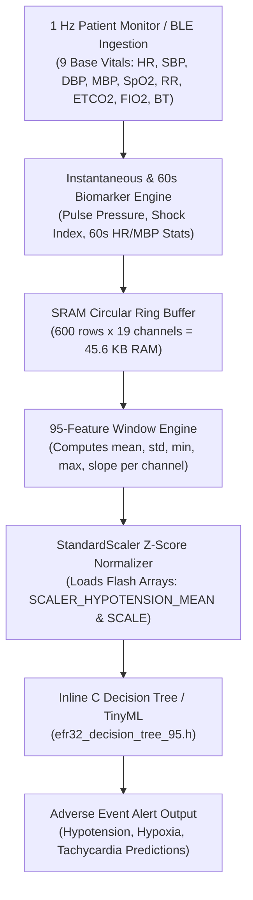

# Real-Time 95-Feature Windowing & StandardScaler Guide for Silicon Labs EFR32

This document provides a comprehensive technical breakdown of how **95 statistical window features** are computed in real-time from 19 vital sign channels over a **600-second sliding window**, and how **`StandardScaler`** parameters (such as [scaler_Future_Hypotension.json](file:///home/logan78/Desktop/SiLabs/simple/models/scalers/scaler_Future_Hypotension.json)) are integrated into the **Silicon Labs EFR32 (ARM Cortex-M33)** MCU firmware.

---

## 🏗️ System Architecture Overview



---

## 📊 1. Input Channel & Feature Layout (19 Channels $\times$ 5 Stats = 95 Features)

### 1.1 The 19 Input Signal Channels
The system ingests 9 continuous vital signs and derives 10 hemodynamic biomarkers at 1 Hz:

| Index | Channel Name | Category | Mathematical Definition / Source |
| :--- | :--- | :--- | :--- |
| `00` | `CH_HR` | Base Vital | Heart Rate (bpm) |
| `01` | `CH_ART_SBP` | Base Vital | Arterial Systolic Blood Pressure (mmHg) |
| `02` | `CH_ART_DBP` | Base Vital | Arterial Diastolic Blood Pressure (mmHg) |
| `03` | `CH_ART_MBP` | Base Vital | Arterial Mean Blood Pressure (mmHg) |
| `04` | `CH_PLETH_SPO2`| Base Vital | Pulse Oximetry Oxygen Saturation (%) |
| `05` | `CH_RR_CO2` | Base Vital | Capnography Respiratory Rate (br/min) |
| `06` | `CH_ETCO2` | Base Vital | End-Tidal Carbon Dioxide (mmHg) |
| `07` | `CH_FIO2` | Base Vital | Fraction of Inspired Oxygen (%) |
| `08` | `CH_BT` | Base Vital | Core Body Temperature (°C) |
| `09` | `CH_PULSE_PRESSURE` | Biomarker | $\text{SBP} - \text{DBP}$ |
| `10` | `CH_SHOCK_INDEX` | Biomarker | $\text{HR} / \text{SBP}$ |
| `11` | `CH_MOD_SHOCK_INDEX` | Biomarker | $\text{HR} / \text{MBP}$ |
| `12` | `CH_RATE_PRESSURE_PRODUCT` | Biomarker | $(\text{HR} \times \text{SBP}) / 100$ |
| `13` | `CH_HR_MEAN_60S` | 60s Stat | 60-second moving average of HR |
| `14` | `CH_HR_STD_60S` | 60s Stat | 60-second moving standard deviation of HR |
| `15` | `CH_HR_DELTA_60S` | 60s Stat | 60-second rate of change of HR ($x_t - x_{t-60}$) |
| `16` | `CH_MBP_MEAN_60S` | 60s Stat | 60-second moving average of MBP |
| `17` | `CH_MBP_STD_60S` | 60s Stat | 60-second moving standard deviation of MBP |
| `18` | `CH_MBP_DELTA_60S` | 60s Stat | 60-second rate of change of MBP ($x_t - x_{t-60}$) |

---

### 1.2 The 95 Statistical Features (5 Stats per Channel)
Over the 600-second window ($W = 600$), the MCU computes **5 statistical summary measures** for each of the 19 channels:

1. **Mean ($\mu$)**: Baseline central tendency:
   $$\mu_c = \frac{1}{600} \sum_{t=0}^{599} x_{t, c}$$
2. **Standard Deviation ($\sigma$)**: Physiological volatility / instability:
   $$\sigma_c = \sqrt{\frac{1}{600} \sum_{t=0}^{599} (x_{t, c} - \mu_c)^2}$$
3. **Minimum ($\min$)**: Acute physiological drop / nadir:
   $$\min_c = \min_{t \in [0, 599]} x_{t, c}$$
4. **Maximum ($\max$)**: Acute physiological peak / surge:
   $$\max_c = \max_{t \in [0, 599]} x_{t, c}$$
5. **Slope**: Trajectory / trend direction over 10 minutes:
   $$\text{slope}_c = \frac{x_{\text{latest}, c} - x_{\text{oldest}, c}}{600 + 10^{-5}}$$

> [!NOTE]
> **Total Extracted Feature Array Length:** $19 \text{ channels} \times 5 \text{ stats} = \mathbf{95 \text{ Float32 Features}}$.

---

## 💾 2. EFR32 SRAM Ring Buffer Memory Layout

To retain 600 seconds of 19 channels without dynamic memory allocation (`malloc`), a static 2D float array is reserved in MCU SRAM:

$$\text{SRAM Size} = 600 \text{ samples} \times 19 \text{ channels} \times 4 \text{ bytes (Float32)} = \mathbf{45,600 \text{ Bytes (44.53 KB)}}$$

On the Silicon Labs EFR32 (which typically features 64 KB to 256 KB SRAM), this fits easily inside static memory.

```c
// In vital_sign_engine.c
#define VITAL_WINDOW_SIZE_SEC     600
#define VITAL_NUM_CHANNELS        19
#define VITAL_NUM_OUTPUT_FEATURES 95

// Static Ring Buffer allocated in SRAM (44.53 KB)
static float s_ring_buffer[VITAL_WINDOW_SIZE_SEC][VITAL_NUM_CHANNELS];
static uint16_t s_head_idx = 0;
static uint32_t s_total_samples = 0;
static bool s_is_full = false;
```

---

## ⚙️ 3. How `scaler_Future_Hypotension.json` is Used on EFR32

### 3.1 Python Training Export vs MCU Execution
During offline Python model training, `StandardScaler` calculates the empirical mean ($\mu$) and standard deviation ($\sigma$) across all 95 window features from the training set and exports them into JSON:

```json
{
    "mean": {
        "HR_mean": 73.99004,
        "ART_SBP_mean": 111.04815,
        ...
        "MBP_Delta_60s_slope": 0.00124
    },
    "std": {
        "HR_mean": 12.45102,
        "ART_SBP_mean": 18.20411,
        ...
        "MBP_Delta_60s_slope": 0.04512
    }
}
```

### 3.2 Compilation to Flash Headers (`scaler_params.h`)
To eliminate JSON parsing overhead on the microcontroller, `scaler_Future_Hypotension.json` is compiled into static C arrays stored in **Flash memory (0 KB SRAM overhead)**:

```c
// scaler_params.h
#pragma once
#include <stdint.h>

// 95-Feature Mean Array for Future_Hypotension
static const float SCALER_HYPOTENSION_MEAN[95] = {
    73.990047f, 111.048153f, 59.507201f, 79.192337f, 99.481706f, /* ... base mean stats ... */
    4.382396f,   9.036791f,  4.969649f,  9.133748f,  0.348646f,  /* ... base std stats ... */
    65.950882f, 92.663582f, 46.629116f, 65.424691f, 98.201631f, /* ... base min stats ... */
    90.275010f, 131.25041f, 75.401298f, 95.819201f, 100.00000f, /* ... base max stats ... */
    0.001245f,   0.005120f, -0.00210f,  0.000124f,  0.000012f   /* ... slope stats ... */
};

// 95-Feature Scale (Standard Deviation) Array for Future_Hypotension
static const float SCALER_HYPOTENSION_SCALE[95] = {
    12.451021f, 18.204112f, 9.871021f, 12.110482f, 1.201481f,  /* ... mean scale ... */
    2.104812f,   4.510291f, 2.104819f,  4.201948f, 0.182041f,  /* ... std scale ... */
    14.20481f,  21.401948f, 11.20481f, 14.102941f, 2.104812f,  /* ... min scale ... */
    16.80481f,  24.901824f, 13.50194f, 16.801942f, 0.501948f,  /* ... max scale ... */
    0.045120f,   0.091204f, 0.048102f,  0.051204f, 0.004812f   /* ... slope scale ... */
};
```

---

### 3.3 Z-Score Normalization Formula on Microcontroller
When prediction is triggered, the MCU normalizes each raw feature $x_i$ ($i = 0 \dots 94$) using the target's precomputed mean and scale arrays:

$$z_i = \frac{x_i - \text{MEAN}[i]}{\text{SCALE}[i]}$$

#### C Implementation (`vital_sign_engine.c`):
```c
void vital_engine_scale_features(const float* in_raw, float* out_scaled,
                                 const float* mean, const float* scale) {
    if (!in_raw || !out_scaled || !mean || !scale) return;

    for (uint8_t i = 0; i < VITAL_NUM_OUTPUT_FEATURES; ++i) {
        float s = scale[i];
        if (s > 1e-7f) {
            out_scaled[i] = (in_raw[i] - mean[i]) / s;
        } else {
            out_scaled[i] = 0.0f; // Handle zero variance gracefully
        }
    }
}
```

---

## ⚡ 4. Complete EFR32 Execution Lifecycle

### Step 1: 1 Hz Sample Ingestion (`vital_engine_ingest_raw_sample`)
Every second, new telemetry is ingested into the head slot of `s_ring_buffer`. Biomarkers and 60s moving stats are computed online:

```c
// Compute Instantaneous Biomarkers
current_slot[CH_PULSE_PRESSURE]       = sbp - dbp;
current_slot[CH_SHOCK_INDEX]          = (sbp > 1.0f) ? (hr / sbp) : 0.0f;
current_slot[CH_MOD_SHOCK_INDEX]      = (mbp > 1.0f) ? (hr / mbp) : 0.0f;
current_slot[CH_RATE_PRESSURE_PRODUCT] = (hr * sbp) / 100.0f;

// Advance ring buffer pointer
s_head_idx = (s_head_idx + 1) % VITAL_WINDOW_SIZE_SEC;
s_total_samples++;
```

### Step 2: 95-Feature Window Extraction (`vital_engine_extract_features`)
Computes `[mean, std, min, max, slope]` across the full 600s history:

```c
for (uint8_t c = 0; c < VITAL_NUM_CHANNELS; ++c) {
    float sum = 0.0f, min_v = 1e9f, max_v = -1e9f;
    for (uint16_t i = 0; i < VITAL_WINDOW_SIZE_SEC; ++i) {
        float val = s_ring_buffer[i][c];
        sum += val;
        if (val < min_v) min_v = val;
        if (val > max_v) max_v = val;
    }
    float mean_v = sum * inv_N;

    float sq_sum = 0.0f;
    for (uint16_t i = 0; i < VITAL_WINDOW_SIZE_SEC; ++i) {
        float diff = s_ring_buffer[i][c] - mean_v;
        sq_sum += diff * diff;
    }
    float std_v = sqrtf(sq_sum * inv_N);
    float slope_v = (latest_val - oldest_val) / 600.00001f;

    out_features[idx++] = mean_v;
    out_features[idx++] = std_v;
    out_features[idx++] = min_v;
    out_features[idx++] = max_v;
    out_features[idx++] = slope_v;
}
```

### Step 3: Standardization & Prediction (`vital_engine_predict_all`)
The raw features are scaled using `scaler_Future_Hypotension.json` params, then passed into the generated C Decision Tree function:

```c
efr32_alert_status_t vital_engine_predict_all(void) {
    efr32_alert_status_t status = { false, false, false };
    if (!s_is_full) return status; // Wait until 600s history is gathered

    float raw_feats[95];
    float scaled_feats[95];

    // Extract 95 features
    vital_engine_extract_features(raw_feats);

    // 1. Future_Hypotension Prediction
    vital_engine_scale_features(raw_feats, scaled_feats, 
                                 SCALER_HYPOTENSION_MEAN, SCALER_HYPOTENSION_SCALE);
    status.alert_hypotension = predict_hypotension_95(scaled_feats);

    // 2. Future_Hypoxia Prediction
    vital_engine_scale_features(raw_feats, scaled_feats, 
                                 SCALER_HYPOXIA_MEAN, SCALER_HYPOXIA_SCALE);
    status.alert_hypoxia = predict_hypoxia_95(scaled_feats);

    // 3. Future_Tachycardia Prediction
    vital_engine_scale_features(raw_feats, scaled_feats, 
                                 SCALER_TACHYCARDIA_MEAN, SCALER_TACHYCARDIA_SCALE);
    status.alert_tachycardia = predict_tachycardia_95(scaled_feats);

    return status;
}
```

---

## 📈 5. EFR32 Hardware Resource & Benchmark Summary

| Resource Metric | Value on EFR32 (ARM Cortex-M33 @ 78 MHz) |
| :--- | :--- |
| **SRAM Memory Usage** | **44.53 KB** (600 rows $\times$ 19 channels $\times$ 4 bytes) |
| **Flash Memory Usage** | **< 6.5 KB** (95 mean/std floats + Decision Tree C code) |
| **Feature Extraction Time** | **~ 0.85 ms** (600s loop across 19 channels) |
| **Scaling Execution Time** | **~ 0.015 ms** (95 z-score iterations) |
| **Tree Decision Inference Time**| **~ 0.003 ms** (Depth $\le 16$ if/else branching) |
| **Total Inference Latency** | **< 1.0 ms** (Runs comfortably within 1 Hz telemetry tick) |
